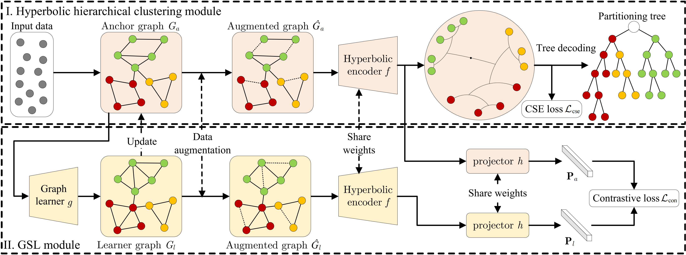

# HypCSE
### Hyperbolic Continuous Structural Entropy Neural Networks for Hierarchical Clustering

Framework of HypCSE.
(I) In the hyperbolic hierarchical clustering module, we construct an anchor graph $G_a$ from the input data, encode it as hyperbolic embedding using hyperbolic encoder $f(\cdot)$, and decode it into a binary partitioning tree for hierarchical clustering.
(II) In the GSL module, we learn a leaner graph $G_l$ using graph learner $g(\cdot)$, update $G_a$ from $G_l$, and guide $g(\cdot)$ via contrastive learning.

# Installation
Install the required packages listed in the file ```requirements.txt```. The code is tested on Python 3.9.0.

Then install the ```mst``` and ```unionfind``` packages which are used to decode embeddings into trees and compute the discrete Dendrogram Purity, Structural Entropy, and Dasgupta Cost efficiently: 

```cd mst; python setup.py build_ext --inplace```

```cd unionfind; python setup.py build_ext --inplace```

# Usage
In the root directory of this project:
```
python main.py [--dataset DATASET]
```

example: ```python main.py --dataset Zoo```
